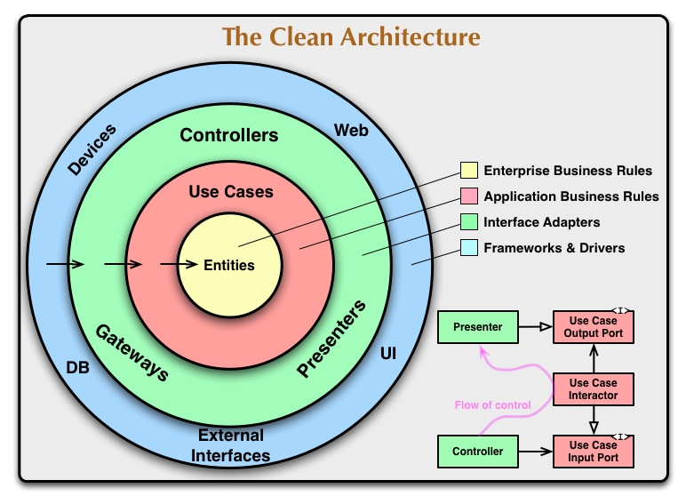
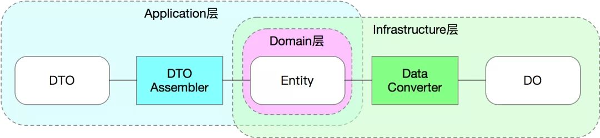

# 整洁架构 ( Go )

## <a id="contents">目录</a>

主要围绕如下几点展开讨论，

1.  **代码规范**
    1.  分层思路
    2.  目录结构
    3.  数据分层
2.  **目录结构**
    1.  每一层拆分后，水平是否需要在进行分层
    2.  公共的功能放在什么地方
3.  **工程化规范**
    1.  errors 统一处理规范
    2.  API 接口的规范
4.  **其他**
    1.  如何保障测试
    2.  错误日志太多：规范日志的输出
    3.  告警太多，导致几乎没人再去关注告警


<br /><hr />

## 架构思想

工程中大量借鉴了 [The Clean Architecture](https://blog.cleancoder.com/uncle-bob/2012/08/13/the-clean-architecture.html) 和 [DDD](https://en.wikipedia.org/wiki/Domain-driven_design) 提出的思想，所以先对这 2 个架构的基本思路进行介绍。

整洁架构的主要思想可以参考 [The Clean Architecture](https://blog.cleancoder.com/uncle-bob/2012/08/13/the-clean-architecture.html) 这篇文章，DDD 可以参考 [阿里技术专家详解 DDD 系列](https://zhuanlan.zhihu.com/p/366395817) 文章。


**整洁架构的好处**

引入整洁架构带来的好处主要包括：

1. 独立于框架：不应该依赖于某种框架，也不需要让系统适应框架。
2. 可被测试性：可以脱离各种依赖进行测试，比如：UI、数据库、Web 服务等外部因素。
3. 独立的 UI：对 UI 进行解耦合，不依赖于具体的 UI 实现，也较为容易的可以切换 UI，比如从 Web 界面切换到命令行界面。
4. 独立于数据库：**业务逻辑**与具体的数据库解耦，不依赖于具体的数据库，不关心是 MySQL、Oracle 或者其他任何类型的数据库。
5. 独立于任何外部的依赖：**业务逻辑**不需要关心任何的外部接口。

**整洁架构的模型**



上图描述了整洁架构的一个基本模型示例，介绍一下文中的基本概念：

1. Entities：即实体，类似于 DDD 中的 Domain 层的概念，里面包含对应的**业务逻辑**。
2. Use Cases：用例，类似于 DDD 中的 Application Service，主要包含各种**业务逻辑的编排**。
3. 各类依赖和数据渲染层在外层，不会对内部的业务逻辑规则产生影响。
4. 最重要的是：在图中的依赖关系，**内部圈不依赖外层圈**。
5. 虽然实际的调用关系是从外层一层一层的调用到最内部的业务逻辑，但是是依靠 [依赖注入](https://zh.wikipedia.org/wiki/%E4%BE%9D%E8%B5%96%E6%B3%A8%E5%85%A5) 的 [控制反转](https://zh.wikipedia.org/zh-hans/%E6%8E%A7%E5%88%B6%E5%8F%8D%E8%BD%AC) 方式进行解耦。


<br /><hr />

## 代码规范

代码的目录结构参考了 [github.com/go-kit/kit](https://github.com/go-kit/kit)、[github.com/go-kratos/kratos](https://github.com/go-kratos/kratos)、[github.com/golang-standards/project-layout](https://github.com/golang-standards/project-layout) 等工程的代码结构思想，提出下列规范：

从根目录，开始分为：


### /api

**职责**

- 定义接口协议 DTO 结构体。可以引入 `protobuf` 来定义协议结构体。
- 路由注册
- 请求/响应序列化和反序列化

**如何测试**

- 使用 [httptest](https://pkg.go.dev/net/http/httptest) 模拟 http server ， 然后请求接口。

**测试关注点**

- HTTP 请求和响应的序列化是否符合预期


<br />


###  /cmd

**职责**

- `main.go` 及 `func main()`
- `func main` 函数中，做服务的初始化、依赖注入。这里会有两个问题：
  - 导致 main 方法可能特别长。[go-kit FAQ - Dependency Injection — Why is func main always so big?](https://gokit.io/faq/#dependency-injection-mdash-why-is-func-main-always-so-big) 这篇文章有解释。
    - 需要在 main 函数中管理所有依赖的生命周期。
    - 要用**显示的**方式将依赖注入。
  - 每次依赖注入都会非常麻烦。可以借用 [wire](https://pkg.go.dev/github.com/google/wire) 工具生成依赖注入的代码。


<br />


### /internal

强制增加 `/internal` package，防止其他工程随意引用。

- 可以避免循环引用的问题。
- 规范调用关系，如果不是我们自己服务的调用的话，那么就应该使用 rpc 的调用方式。

<br />

在这下面可以创建子目录，


| 子目录                | 职责                                                                                                                                                             | 备注                                                                                                                                                                                                                                                                                                                                                                                                                                                                                                                                                                                                                                                                                                                                                                                                                                                                                                                                                                                                                                                                                        |
| --------------------- | ---------------------------------------------------------------------------------------------------------------------------------------------------------------- | ------------------------------------------------------------------------------------------------------------------------------------------------------------------------------------------------------------------------------------------------------------------------------------------------------------------------------------------------------------------------------------------------------------------------------------------------------------------------------------------------------------------------------------------------------------------------------------------------------------------------------------------------------------------------------------------------------------------------------------------------------------------------------------------------------------------------------------------------------------------------------------------------------------------------------------------------------------------------------------------------------------------------------------------------------------------------------------------- |
| **/internal/server**  | HTTP Server, gRPC Server 的定义。在这里面主要是对 Server 的生命周期进行管理，这也是很多微服务框架的主要工作之一。比如，对 HTTP Server 的优雅退出进行管理。<br /> | 1、创建 HTTP Server，**管理 HTTP Server 的生命周期**，包括优雅退出的策略。2、 ( **重点** ) ( 类似于 gRPC ) 使用 Register 的方式将 Server 注入到 /api 中，绑定 Server 与 http router 的关系。                                                                                                                                                                                                                                                                                                                                                                                                                                                                                                                                                                                                                                                                                                                                                                                                                                                                                                |
| **/internal/service** | 1、**重点：参数转换**，并做简单的参数校验。 2、做业务数据的渲染。 ( 由于没有 BFF，所以将 BFF 的功能放到这一层做，但是会导致这一层的代码膨胀 )                    | service层 --> usecase层 中的 Usercase。                                                                                                                                                                                                                                                                                                                                                                                                                                                                                                                                                                                                                                                                                                                                                                                                                                                                                                                                                                                                                                                     |
| **/internal/domain**  | 保存 domain 级别的对象，其中包含：`domain object` 、 `value object` 、 `domain service` 。 按照 DDD 中的思想，Domain Object 里面包含各自负责领域的业务逻辑。     | 1. **这一层是业务的核心层级。**<br /> 2. 这一层按照现在的分层模式，非常独立，不会向上依赖，也不会向下依赖。<br /> 3. 这一层的对象是 `Domain Object`，需要与 `PO (Persistence Object)` 或者叫 `Data Object` 区分。<br /> 4. `Domain Object` 是带有对应的业务逻辑， `PO` 只是做个表的简单映射，如果是使用 ORM 工具的话，那么就对应 ORM 映射的对象。<br /> 5. 在这一层下面，可以按照业务的子领域创建各自的 package。<br /> 6. 按照 DDD 的设计思想，本层使用 `充血模型`。<br /> 7. 如何更好的设计领域对象 ( Domain Object ) 强烈推荐参考：[ddd的战术篇: application service, domain service, infrastructure service](https://blog.csdn.net/abchywabc/article/details/79362975) 、 [阿里技术专家详解 DDD 系列 第五讲：聊聊如何避免写流水账代码](https://zhuanlan.zhihu.com/p/366395817)<br /> 8.「不包含」UI 渲染，也「不包含」数据库或 RPC 框架的具体实现。<br /> 9. repo 的依赖，由于是 interface 注入，所以直接 mock 的方式。 ( 可以引入 Go 官方的 [gomock](https://pkg.go.dev/github.com/golang/mock/gomock) )<br /><br />本层的难点：如何定义各种各样的 `Domain Object`、`Domain Service`。 |
| **/internal/usecase** | Use Cases，即 DDD 中的 `Application Service`，它主要的作用是对 domain 业务的**编排**。<br />若有必要，也可以在该 package 下面定义 `子 Usecase`。                 |                                                                                                                                                                                                                                                                                                                                                                                                                                                                                                                                                                                                                                                                                                                                                                                                                                                                                                                                                                                                                                                                                             |
| **/internal/repo**    | 各种数据依赖的具体实现，包括 DB、RPC、缓存等。这里面存放 PO 数据，这些数据就是 **简单的表映射**。                                                                | 这里的对象使用 `失血模型` 或者 `贫血模型`。                                                                                                                                                                                                                                                                                                                                                                                                                                                                                                                                                                                                                                                                                                                                                                                                                                                                                                                                                                                                                                                 |


<br />


### /pkg

里面定义可以共享出去的工具。由于是可以直接让别人用，这里面的 package 当作基础依赖库使用。既然又是基础依赖库，它里面尽可能的不包含第三方依赖。


<br /> 

[↑ top](#contents)

<hr />


## 数据规范

在整个系统中，主要分为下列几个对象：

1. DTO （Data Transfer Object）- 数据传输对象。对应的是请求、响应的结构体对象。不存在业务逻辑，可以使用 `protobuf` 来约定。
2. DO （Domain Object）- 领域对象。包含各个领域的业务逻辑。
3. PO （Persistant Object）- 持久对象。如果是使用 ORM 的话，那么基本上对应的是表的映射对象。该对象基本上使用贫血模型，除了简单的校验逻辑外，基本上不包含任何业务逻辑。*注意：在有的地方，该对象叫做：DO （Data Object）*。

<br />

**分层数据的隔离**

在实际开发过程中，有的对象从 DTO 到 DO，或者从 DO 再到 PO 对象很相似，或者一摸一样，但是对应的职责实际上是完全不同，所以必须进行完全隔离。

借用 [阿里技术专家详解DDD系列 第三讲 - Repository模式](https://zhuanlan.zhihu.com/p/348706530) 中的一张图，（ **注意：下图中的 DO 实际上代表的是 PO 对象** ）




- `DTO - DO` - 引入 `Assembler`，用作 DTO 对象的组装。

- `DO - PO` - 引入 `Converter`，用作 Domain Object 的组装。

为了避免大的结构体对象的赋值的繁琐工作，在做对象组装的时候，可以引入 [jinzhu/copier](https://github.com/jinzhu/copier) 的工具辅助进行组装。（ **这里一定要包含对应的单元测试！！！** ）


<br /> 

[↑ top](#contents)

<hr />


## 单元测试

**Mock 工具**

由于使用接口注入的方式，所以在做对应模块测试的时候，可以使用 [golang/mock](https://github.com/golang/mock) 的工具生成对应接口的 mock 实现代码。

为了便于开发过程中的生成，开发了个小工具辅助生成。安装过程为：

1. 安装 [golang/mock](https://github.com/golang/mock)。

```bash
go install github.com/golang/mock/mockgen@v1.6.0
```

2. 下载 `gmh`，运行下列命令即可生成。

```bash

# 会在当前目录下，生成 xxx_mock.go 文件。
gmh -src my_interface.go
```


## 参考资料

- [The Clean Architecture](https://blog.cleancoder.com/uncle-bob/2012/08/13/the-clean-architecture.html)

- [Microsoft - Design a DDD-oriented microservice](https://docs.microsoft.com/en-us/dotnet/architecture/microservices/microservice-ddd-cqrs-patterns/ddd-oriented-microservice)

- https://github.com/bxcodec/go-clean-arch - 按照 Bob 大叔的整洁代码架构分层。

    > 简单的示例，看看就好，在复杂的业务场景下没有太多的参考价值。

- [The Clean Architecture](https://blog.cleancoder.com/uncle-bob/2012/08/13/the-clean-architecture.html) - Bob 大叔的 Clean 架构

    - 中文翻译：**[架构整洁之道](https://www.cnblogs.com/yjf512/archive/2012/09/10/2678313.html)**

- https://github.com/alibaba/COLA - 阿里巴巴的 Clean Architecture 的示例。

    

    这里的分层的数据讲的还是比较清晰。

- https://github.com/manakuro/golang-clean-architecture - Golang 的一个 DDD 版本

    > 个人觉得不好，对于实际的场景其实比较复杂，这种简单的架构看看即可，没有太大的参考价值。

    推荐来源： [DDD 之代码架构](https://www.yasinshaw.com/articles/112) ，该文章总结了几个重点问题：

    - 聚合根的定义：永远的难题，很难定义。

- [Domain Driven Design: Domain Service, Application Service](https://stackoverflow.com/questions/2268699/domain-driven-design-domain-service-application-service)

    在这里面介绍了什么是 Domain Service：

    - 集合了 domain object 的业务逻辑和业务规则，但是又无法将这些逻辑放到具体的对象里面。
    - Domain Service 是不存在或最好不存在状态的。但是可以改变 Domain Object 中的状态。

- [https://mp.weixin.qq.com/s/Xzlt_WcdcfLWhofafY3c6g](https://mp.weixin.qq.com/s/Xzlt_WcdcfLWhofafY3c6g)

    > 腾讯的整洁架构实践，个人觉得不是很好。最致命的一个原因是：直接使用了一个通用的 `model`，从前到后传递，这个就非常不合理。
    > 首先对于数据的职责定义还是需要做区分，比如需要分成： `DTO`、 `Domain Object` 、 `PO` 等数据类型，因为每个数据类型承担的职责起码就不一样。
    > 而文中直接定义的 `model` 就很类似于传统 `MVC` 的那一套，而 Bob 大叔在他的书里面就明确说了这是两套方法论。
    > 另外，Bob 大叔也说了，很多对象看着是类似或者一样，但是其实是两个东西。

- [一篇文章讲清楚VO，BO，PO，DO，DTO的区别](https://zhuanlan.zhihu.com/p/102389552)